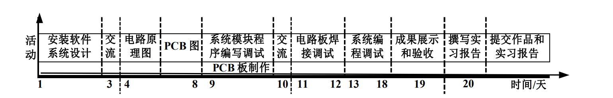

# 系统架构综合实习作业项目

### time table

### 项目参考

- github: https://github.com/scottbez1/smartknob
- demo video: https://www.youtube.com/watch?v=ip641WmY4pA
- 讲解视频：https://www.youtube.com/watch?v=Q76dMggUH1M&t=521s

### 器材

- [x] 240x240 round LCD ("GC9A01")
- [x] 无感无刷电机 BLDC
- [x] 霍尔感应器 MT6701
- [x] 电机驱动 TMC6300-LA-T
- [x] 主控 ESP32
- [x] 压力传感器 HX711 
- [x] 应变片 BF350-3AA * 2
- [x] LED灯 SK6812-SIDE-A * 8
- [x] USB-C(2.0)接口
- [x] 串口转换器 CH340C
- [x] 环境亮度传感器 VEML7700
- [x] 稳压器 AP2114HA-3.3
- [x] LED电流缓冲 SN74LV1T34DBV
- [ ] 背板？Versatile back plate for mounting - use either 4x screws, or 2x 3M medium Command strips (with cutouts for accessing removal tabs after installation)
- [ ] 前盖？Front cover snaps on for easy access to the PCB

### 资料

- 学习参考 [doc/reference/reference.md](doc/reference/reference.md)
- 学习日志 [doc/log/log.md](doc/log/log.md)

