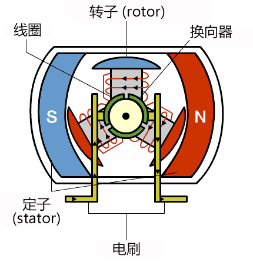
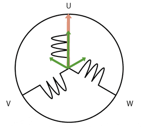

# 系统架构综合实习作业项目

### 项目参考

- github: https://github.com/scottbez1/smartknob
- demo video: https://www.youtube.com/watch?v=ip641WmY4pA
- motor
  - shop: https://www.sparkfun.com/products/20441
  - document: https://cdn.sparkfun.com/assets/e/b/2/8/3/OT-EM3215_DC_Brushless_Gimbal_Motor_3_Phase_Datasheet.pdf
  - discuss: https://github.com/scottbez1/smartknob/issues/16#issuecomment-1094482805%5D

### 器材

- 240x240 round LCD ("GC9A01"), protected by 39.5mm watch glass on rotor
- BLDC gimbal motor, with a hollow shaft for mechanically & electrically connecting the LCD
- Powered by ESP32-PICO-V3-02 (Lilygo TMicro32 Plus module)
- PCB flexure and strain gauges used for press detection (haptic feedback provided via the motor)
- 8 side-firing RGB LEDs (SK6812-SIDE-A) illuminate ring around the knob
- USB-C (2.0) connector for 5V power and serial data/programming (CH340)
- VEML7700 ambient light sensor for automatic backlight & LED intensity adjustment
- Versatile back plate for mounting - use either 4x screws, or 2x 3M medium Command strips (with cutouts for accessing removal tabs after installation)
- Front cover snaps on for easy access to the PCB

### 电机

参考
- [瑞萨电子 > 支持和设计 > arrow_right > Engineer School arrow_right > 何谓BLDC电机](https://www.renesas.cn/cn/zh/support/engineer-school/brushless-dc-motor-01-overview?__utma=65695400.793764067.1623331144.1623331591.1623331591.1&__utmb=65695400.0.10.1623331591&__utmc=65695400&__utmx=-&__utmz=65695400.1623331591.1.1.utmcsr=(direct)%7Cutmccn=(direct)%7Cutmcmd=(none)&__utmv=-&__utmk=188466671?__utma=65695400.793764067.1623331144.1623331591.1623331591.1&__utmb=65695400.0.10.1623331591&__utmc=65695400&__utmx=-&__utmz=65695400.1623331591.1.1.utmcsr=(direct)%7Cutmccn=(direct)%7Cutmcmd=(none)&__utmv=-&__utmk=188466671)
- [瑞萨电子 > 支持和设计 > arrow_right > Engineer School arrow_right > BLDC电机的控制](https://www.renesas.cn/cn/zh/support/engineer-school/brushless-dc-motor-02-inverter-pmw)

电机分类

有刷DC电机

BLDC电机

BLDC电机控制

正弦波控制

