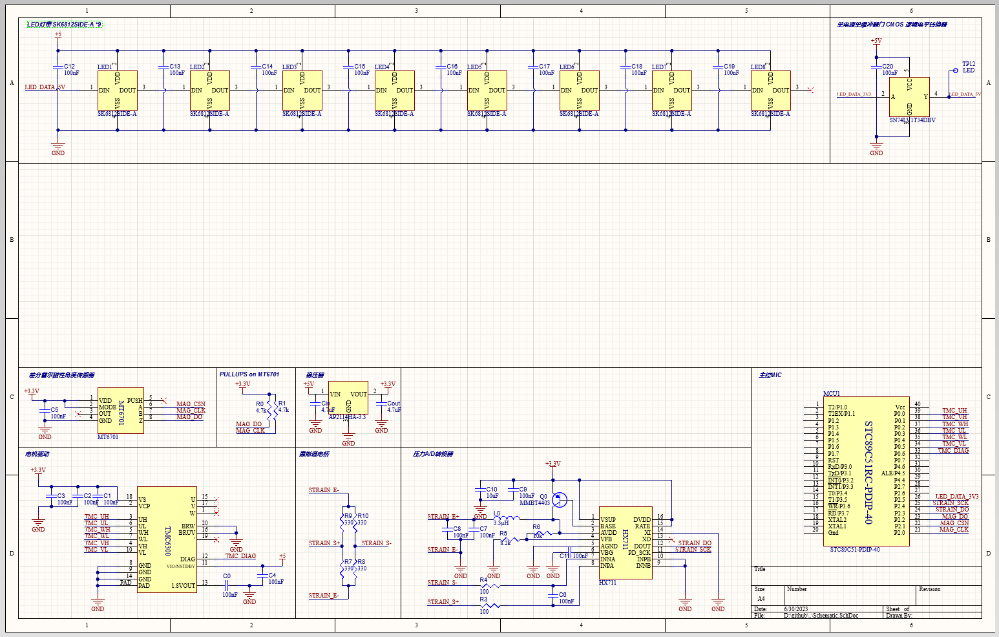
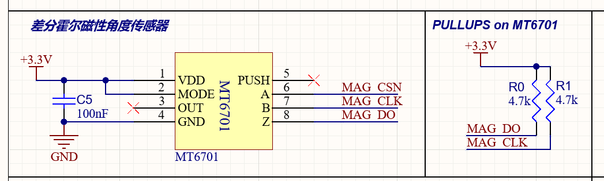
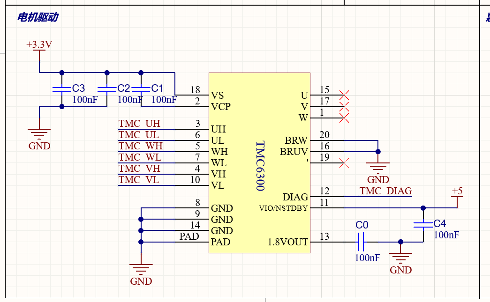
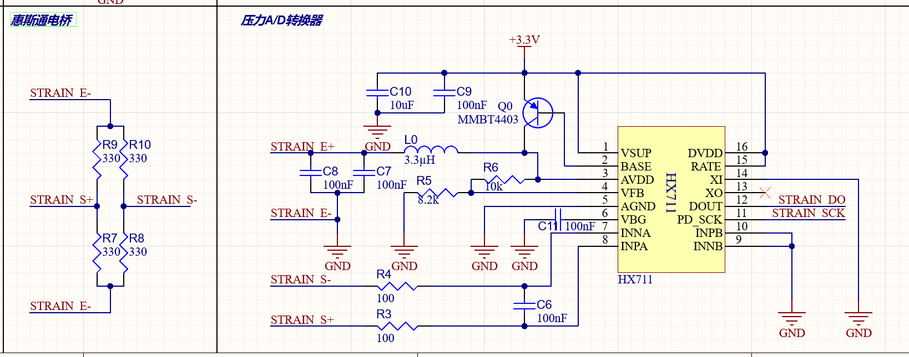
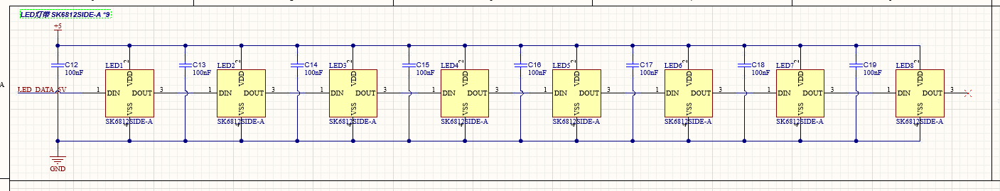
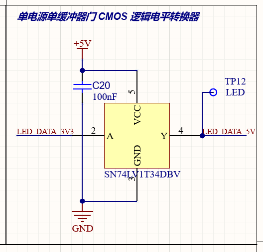
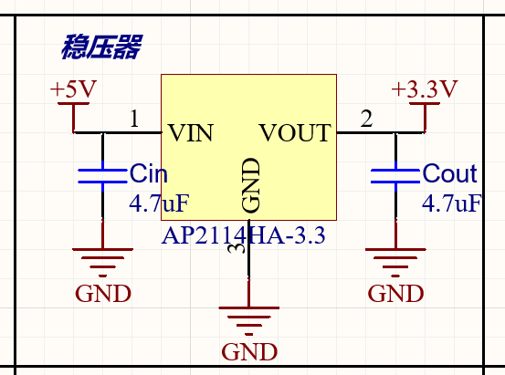

- [2023年6月26日](#2023年6月26日)
- [2023年6月27日](#2023年6月27日)
- [2023年6月28日](#2023年6月28日)
- [2023年6月29日](#2023年6月29日)
- [2023年6月30日](#2023年6月30日)
- [2023年7月1日](#2023年7月1日)
- [2023年7月2日](#2023年7月2日)

### 2023年6月26日

- 课程选择
- 初步构想

### 2023年6月27日

- 忘了

### 2023年6月28日

- 听课

### 2023年6月29日

- 了解电机的基础知识

    通过网络查阅了无感无刷电机、有感无刷电机、有刷电机等知识，学习了此类电机的内部结构，掌握了电机的基础知识。

- 了解无感无刷电机的角度控制

    通过差分霍尔磁性角度传感器可对内部磁场进行感知，并通过信号掌握电机的转动角度。

- 了解项目大致需要的硬件

    通过对开源项目进行分析，清除了项目需要的硬件，包括电机驱动器TMC6300、电磁编码器MT6701、发光管SK6812SIDE-A、压力传感器HX711及其对应的应变片BF350-3AA、环形LCD屏幕和亮度传感器VEML7700等。

- 了解该项目的大致流程

    通过对开源项目的分析，了解了该项目的大致流程，包括电机驱动、电机角度控制、LCD屏幕显示、亮度传感器控制、压力传感器控制等。

- 掌握了 `Altium Desinger` 软件的基本操作

    学习了如何初始化 `SCHLibrary`，了解了如何在元件库中添加元件和插入管脚。之后了解了如何在原理图中导入元件库中的元件，并进行元件连接、文本添加和线条分割等操作。之后通过添加导线、电源和地线，从元件库中导入电阻、电容和三极管等操作，依次绘制了若干元件的原理图

### 2023年6月30日

- 主要内容

    查阅相关原件 datasheet 和开源仓库，绘制PCB图，绘制整体结果如下所示：

    

- 了解BLDC驱动方式

    通过阅读[BLDC驱动基础篇：为什么可以根据BEMF信号换相](https://zhuanlan.zhihu.com/p/610603606#:~:text=%E6%AF%94%E5%A6%82%EF%BC%8C%E5%BD%93BEMF%E4%B8%BA0%E6%97%B6%EF%BC%8C%E7%94%B5%E6%9C%BA%E8%BD%AC%E5%AD%90%E4%B8%80%E5%AE%9A%E6%98%AF%E8%BD%AC%E5%8A%A8%E4%BA%8630%C2%B0%E3%80%82,%E5%BD%93BEMF%E4%BB%8E0%E5%8F%98%E5%88%B0%E6%9C%80%E5%A4%A7%E5%80%BC%E6%97%B6%EF%BC%8C%E7%94%B5%E6%9C%BA%E8%BD%AC%E5%AD%90%E4%B8%80%E5%AE%9A%E8%BD%AC%E5%8A%A8%E4%BA%8660%C2%B0%E3%80%82%20%EF%BC%884%EF%BC%89%E6%82%AC%E7%A9%BA%E7%BA%BF%E5%9C%88%E4%B8%AD%E6%84%9F%E5%BA%94%E7%94%B5%E5%8A%A8%E5%8A%BF%E7%AD%89%E4%BA%8E0%E7%9A%84%E7%82%B9%EF%BC%88%E8%BD%AC%E5%AD%90%E8%BD%AC%E5%8A%A830%C2%B0%EF%BC%89%EF%BC%8C%E5%B0%B1%E7%A7%B0%E4%B8%BA%E5%8F%8D%E7%94%B5%E5%8A%A8%E5%8A%BF%E7%9A%84%E8%BF%87%E9%9B%B6%E7%82%B9%E3%80%82)，复习了感应电动势，了解了无感电机驱动是通过检测悬空线圈中的BEMF过零点进行换相的，无电流的线圈中永磁体转子旋转导致线圈中的磁通发生改变，从而产生感应电动势，通过检测感应电动势的过零点进行换相，从而驱动电机转动。

    在了解[stm32无感无刷电机驱动](https://blog.csdn.net/richardgann/article/details/123094403)时遇到困难，无法掌握相关电路的工作原理，询问老师后得知为电机学原理，不需要掌握相关电路的工作原理，之后将重点放在了原理图的理解和绘制上。

- 掌握了 `Altium Desinger` 软件的快捷键

    `Ctrl+W` 为快速画线，空格键快速旋转元件，`Tab` 键进行信息修改等......

- 绘制了霍尔传感器 MT6701 电路的原理图

    查阅 MT6701 电路对应的 datasheet，了解了其大致功能和特性，其基于霍尔技术，能对 0-360 度的磁场方向进行检测，在其上面放置无刷无感电机，通电后转动电机可通过该传感器获得对应参数，从而驱动 LCD 显示信息。

    根据 datasheet 绘制原理图如下：

    

- 绘制了电机驱动 TMC6300 电路的原理图

    了解了该驱动只作用于增大电流，并不能帮助进行电机控制。

    参照推荐连接方式绘制原理图结果如下：

    

- 学习了压力传感器 HX711 的原理，并绘制原理图

    HX711 是模拟/数字转换器芯片，通过应变片作为传感器，获取压力参数，从而判断是否对物体进行了按压，该元件本来作用于电子称。
    
    在了解了该元件的原理后，发现其中使用了惠斯通电桥等技术，对该技术未进行深入了解，根据参考电路进行了连线
 
    参照接线示例绘制了压力传感器HX711电路的原理图和惠斯通电桥原理图如下：

    

- 学习了LED灯带 SK6812SIDE-A 的使用方法，并绘制原理图

    查阅了相关 datasheet，了解了其工作原理，并参考其推荐电路进行了连线，绘制了原理图如下：

    

    通过 SN74LV1T34DBV 对其进行了电平转换，绘制了原理图如下：

    

- 学习了稳压器的相关内容，并绘制原理图

    稳压器是一种电子元件，其作用是将不稳定的电压转换为稳定的电压，其原理是通过电路中的反馈机制，将输出电压与参考电压进行比较，从而调整输出电压，使其稳定在参考电压附近。

    绘制了 AP2114 稳压器的原理图，如下所示：

    

- 粗略学习了 USB 转串口芯片 CH340 的大致内容

    CH340 是一个 USB 总线的转接芯片，实现 USB 转串口或者 USB 转打印口，未进行深入理解和原理图绘制。

### 2023年7月1日

- 学习了 USB-C 文档

- 学习了 USB-C 转串口芯片 CH340C 的相关内容

- 学习了单片机串口转USB接口的相关串口通讯内容

- 询问老师实现了烧录接口设计，附加开关

- 学习了环境亮度传感器 VEML7700 的相关内容

- 学习了PCB电路设计的基础方法

### 2023年7月2日

- 学习PCB的元件库设计方法

- 根据元件库设计方法设计STC89C51元件库

- 导出 立创EDA 中的元件封装图到 Altium Designer 中

- 学习了如何将SCH库中元件与PCB库中元件进行关联

- 完善原理图，修改元件编号，增加电源开关，完善主控部分电路

- 尝试导出原理图到 PCB 图中

    发现由于其他元件无管脚图，无法导出，继续完善元件管脚图

- 学习了PCB板绘制规范

- 学习了PCB板的细节测量方法，和 datasheet 进行比对