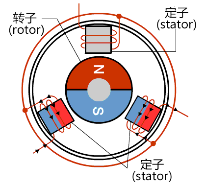
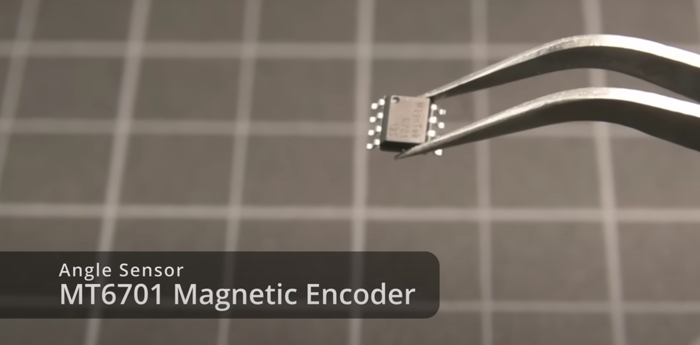

- [整体原理图](#整体原理图)
- [电机](#电机)
- [电子元件](#电子元件)
    - [单片机](#单片机)
    - [电机](#电机-1)
    - [传感器](#传感器)
    - [发光管](#发光管)
    - [其他](#其他)
- [电路绘制](#电路绘制)

# 整体原理图

- 硬件结构图

    

- 电路图

    

# 电机

- BLDC电机

    [瑞萨电子 > 支持和设计 > arrow_right > Engineer School arrow_right > 何谓BLDC电机](https://www.renesas.cn/cn/zh/support/engineer-school/brushless-dc-motor-01-overview?__utma=65695400.793764067.1623331144.1623331591.1623331591.1&__utmb=65695400.0.10.1623331591&__utmc=65695400&__utmx=-&__utmz=65695400.1623331591.1.1.utmcsr=(direct)%7Cutmccn=(direct)%7Cutmcmd=(none)&__utmv=-&__utmk=188466671?__utma=65695400.793764067.1623331144.1623331591.1623331591.1&__utmb=65695400.0.10.1623331591&__utmc=65695400&__utmx=-&__utmz=65695400.1623331591.1.1.utmcsr=(direct)%7Cutmccn=(direct)%7Cutmcmd=(none)&__utmv=-&__utmk=188466671)

    

- BLDC电机控制

     [瑞萨电子 > 支持和设计 > arrow_right > Engineer School arrow_right > BLDC电机的控制](https://www.renesas.cn/cn/zh/support/engineer-school/brushless-dc-motor-02-inverter-pmw)

    

- BLDC电机正弦波控制

    

# 电子元件

### 单片机

- STC89C51RC

### 电机

- 无感电机 IM4018H

    

- 电机驱动器 TMC6300
 
     

### 传感器

- 霍尔传感器 MT6701

     

     

- 压力传感器 HX711 + 应变片BF350-3AA

     

     

- 亮度传感器 VEML7700

     

### 发光管

- SK6812SID * 8

     

### 其他

- USB转串口 `CH340`
- 稳压器 `AP2114HA-3.3`

# 电路绘制

