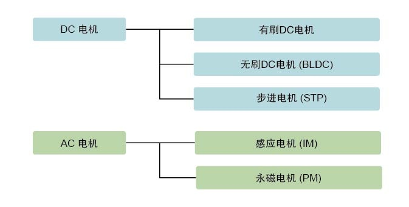
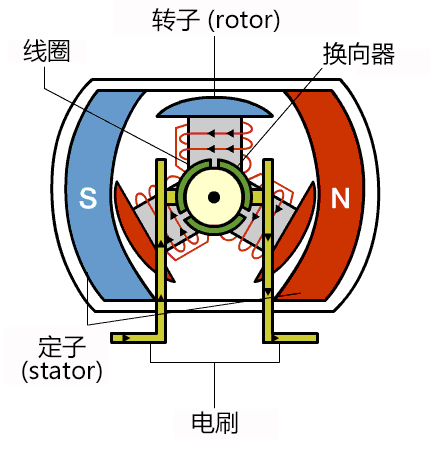
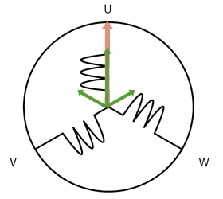

# 电机

### 参考

- [瑞萨电子 > 支持和设计 > arrow_right > Engineer School arrow_right > 何谓BLDC电机](https://www.renesas.cn/cn/zh/support/engineer-school/brushless-dc-motor-01-overview?__utma=65695400.793764067.1623331144.1623331591.1623331591.1&__utmb=65695400.0.10.1623331591&__utmc=65695400&__utmx=-&__utmz=65695400.1623331591.1.1.utmcsr=(direct)%7Cutmccn=(direct)%7Cutmcmd=(none)&__utmv=-&__utmk=188466671?__utma=65695400.793764067.1623331144.1623331591.1623331591.1&__utmb=65695400.0.10.1623331591&__utmc=65695400&__utmx=-&__utmz=65695400.1623331591.1.1.utmcsr=(direct)%7Cutmccn=(direct)%7Cutmcmd=(none)&__utmv=-&__utmk=188466671)
- [瑞萨电子 > 支持和设计 > arrow_right > Engineer School arrow_right > BLDC电机的控制](https://www.renesas.cn/cn/zh/support/engineer-school/brushless-dc-motor-02-inverter-pmw)

### 电机分类

### 有刷DC电机

### BLDC电机

### BLDC电机控制

### 正弦波控制

### 传感器

| 传感器种类 | 主要用途 | 特征 |
|:---:|:---:|:---:|
| 霍尔效应传感器 | 120度通电控制 | 每60度获取一次信号。价格较低。不耐热。 |
| 光电编码器 | 正弦波控制、矢量控制 | 有增量型（可得知原位置开始的移动距离）和绝对型（可得知当前位置的角度）两种。分辨率高，但防尘埃能力较弱。 |
| 转角传感器 | 正弦波控制、矢量控制 | 分辨率高。即使在牢固的恶劣环境下也可使用。 |